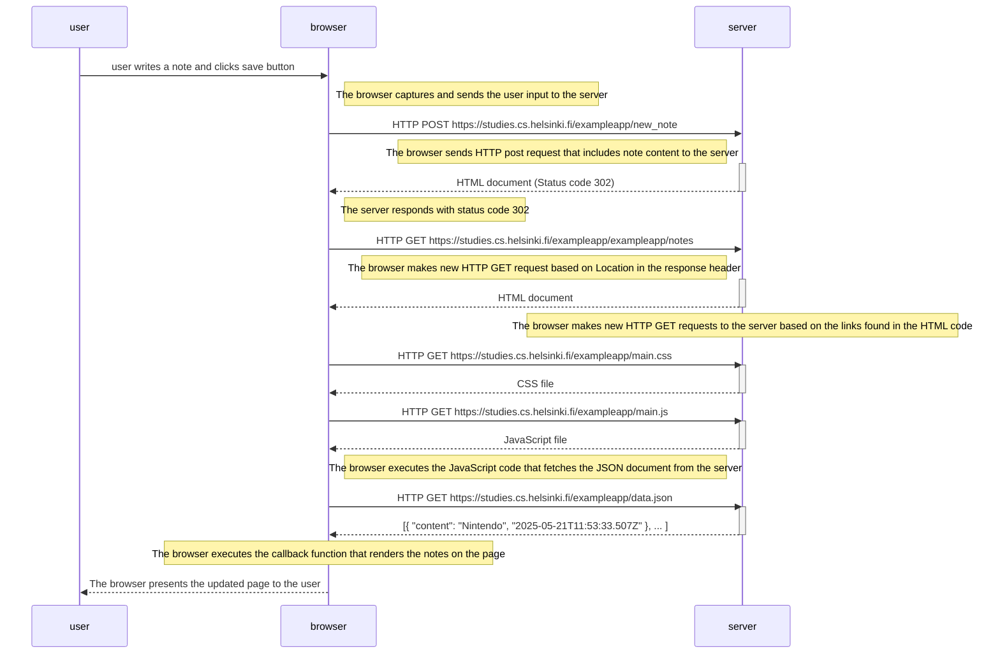

```mermaid
sequenceDiagram
participant user
participant browser
participant server

  user->>browser: user writes a note and clicks save button

  Note right of browser: The browser captures and sends the user input to the server

  browser->>server: HTTP POST https://studies.cs.helsinki.fi/exampleapp/new_note

  Note left of server: The browser sends HTTP post request that includes note content to the server

  activate server
  server-->>browser: HTML document (Status code 302)
  deactivate server

  Note right of browser: The server responds with status code 302

  browser->>server: HTTP GET https://studies.cs.helsinki.fi/exampleapp/exampleapp/notes

  Note left of server: The browser makes new HTTP GET request based on Location in the response header

  activate server
  server-->>browser: HTML document
  deactivate server

  Note over server: The browser makes new HTTP GET requests to the server based on the links found in the HTML code


  browser->>server: HTTP GET https://studies.cs.helsinki.fi/exampleapp/main.css

  activate server
  server-->>browser: CSS file
  deactivate server

  browser->>server: HTTP GET https://studies.cs.helsinki.fi/exampleapp/main.js

  activate server
  server-->>browser: JavaScript file
  deactivate server

  Note right of browser: The browser executes the JavaScript code that fetches the JSON document from the server

  browser->>server: HTTP GET https://studies.cs.helsinki.fi/exampleapp/data.json

  activate server
  server-->>browser: [{ "content": "Nintendo", "2025-05-21T11:53:33.507Z" }, ... ]
  deactivate server

  Note over browser: The browser executes the callback function that renders the notes on the page

  browser-->>user: The browser presents the updated page to the user
```
