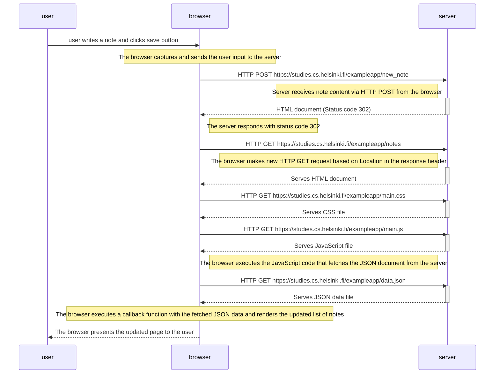

```mermaid
sequenceDiagram
participant user
participant browser
participant server

  user->>browser: user writes a note and clicks save button

  Note over browser: The browser captures and sends the user input to the server

  browser->>server: HTTP POST https://studies.cs.helsinki.fi/exampleapp/new_note

  Note left of server: Server receives note content via HTTP POST from the browser

  activate server
  server-->>browser: HTML document (Status code 302)
  deactivate server

  Note right of browser: The server responds with status code 302

  browser->>server: HTTP GET https://studies.cs.helsinki.fi/exampleapp/notes

  Note left of server: The browser makes new HTTP GET request based on Location in the response header

  activate server
  server-->>browser: Serves HTML document
  deactivate server

  browser->>server: HTTP GET https://studies.cs.helsinki.fi/exampleapp/main.css

  activate server
  server-->>browser: Serves CSS file
  deactivate server

  browser->>server: HTTP GET https://studies.cs.helsinki.fi/exampleapp/main.js

  activate server
  server-->>browser: Serves JavaScript file
  deactivate server

  Note right of browser: The browser executes the JavaScript code that fetches the JSON document from the server

  browser->>server: HTTP GET https://studies.cs.helsinki.fi/exampleapp/data.json

  activate server
  server-->>browser: Serves JSON data file
  deactivate server

  Note over browser: The browser executes a callback function with the fetched JSON data and renders the updated list of notes

  browser-->>user: The browser presents the updated page to the user
```
