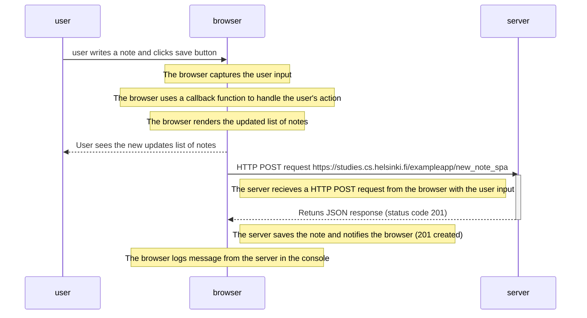

# New note single application diagram

```mermaid
sequenceDiagram
participant user
participant browser

  user->>browser: user writes a note and clicks save button

  Note over browser: The browser captures the user input

  Note over browser: The browser uses a callback function to handle the user's action

  Note over browser: The browser renders the updated list of notes

  browser-->>user: User sees the new updates list of notes

  browser->>server: HTTP POST request https://studies.cs.helsinki.fi/exampleapp/new_note_spa

  activate server
  Note left of server: The server recieves a HTTP POST request from the browser with the user input
  server-->>browser: Retuns JSON response (status code 201)
  deactivate server

  Note right of browser: The server saves the note and notifies the browser (201 created)

  Note over browser: The browser logs message from the server in the console
```
