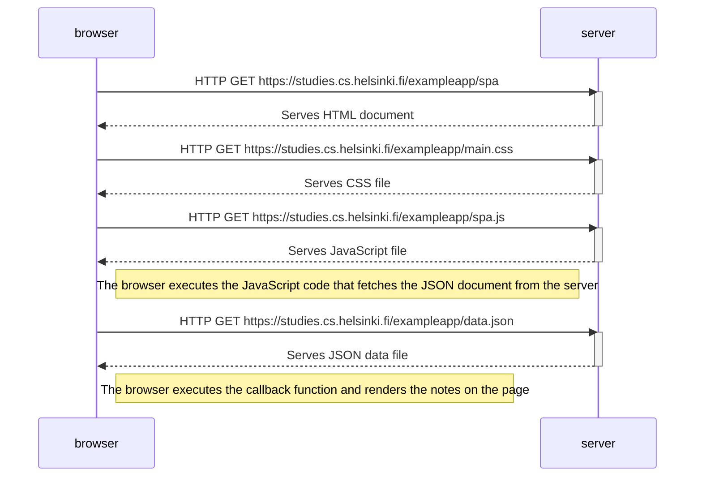

# Single Page Application Diagram

```mermaid
sequenceDiagram
participant browser
participant server

    browser->>server: HTTP GET https://studies.cs.helsinki.fi/exampleapp/spa

    activate server
    server-->>browser: Serves HTML document
    deactivate server

    browser->>server: HTTP GET https://studies.cs.helsinki.fi/exampleapp/main.css

    activate server
    server-->>browser: Serves CSS file
    deactivate server

    browser->>server: HTTP GET https://studies.cs.helsinki.fi/exampleapp/spa.js

    activate server
    server-->>browser: Serves JavaScript file
    deactivate server

    Note right of browser: The browser executes the JavaScript code that fetches the JSON document from the server

    browser->>server: HTTP GET https://studies.cs.helsinki.fi/exampleapp/data.json

    activate server
    server-->>browser: Serves JSON data file
    deactivate server

    Note right of browser: The browser executes the callback function and renders the notes on the page
```
